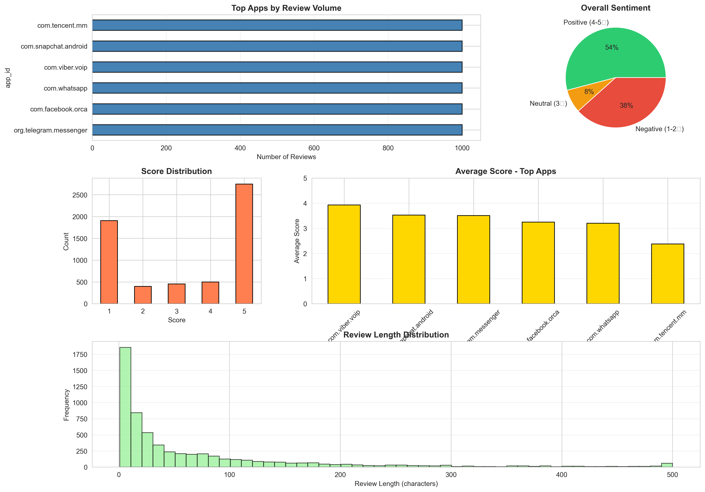
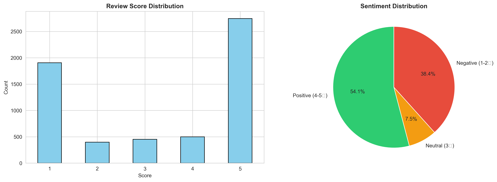
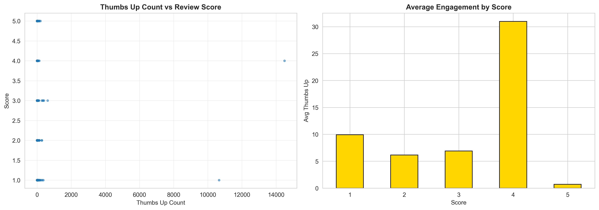
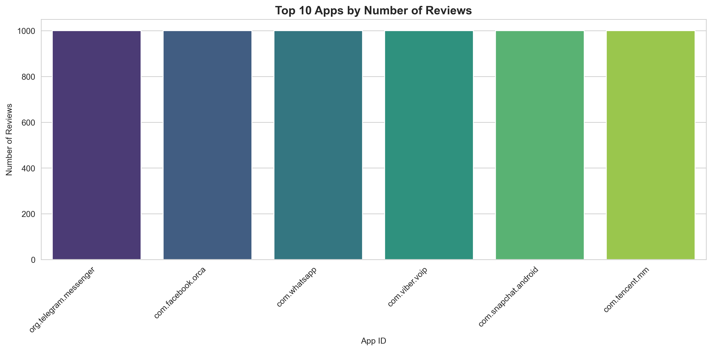
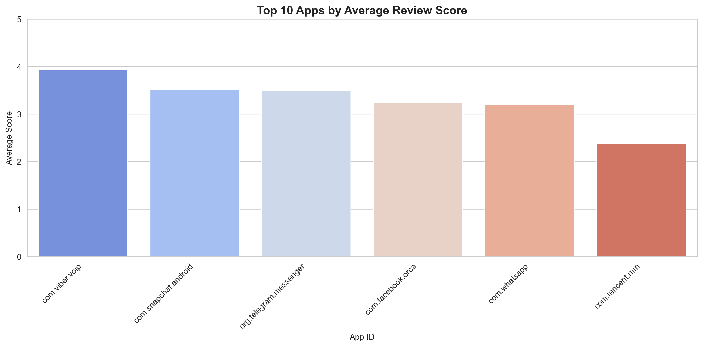
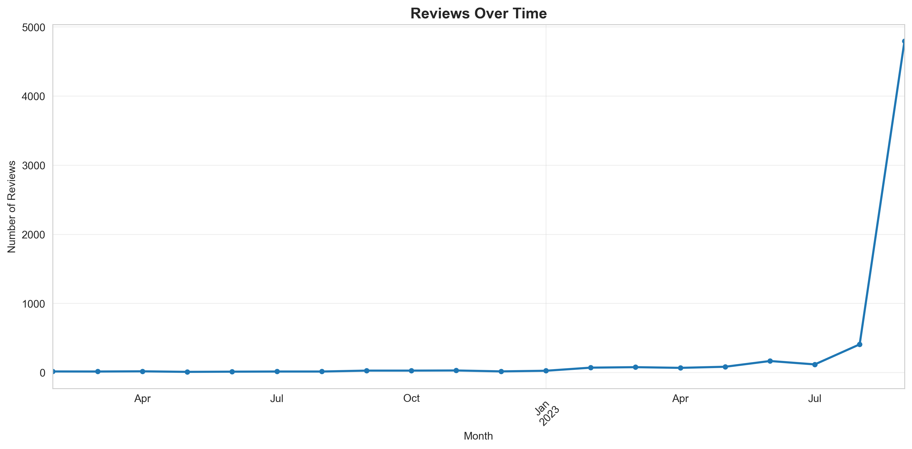
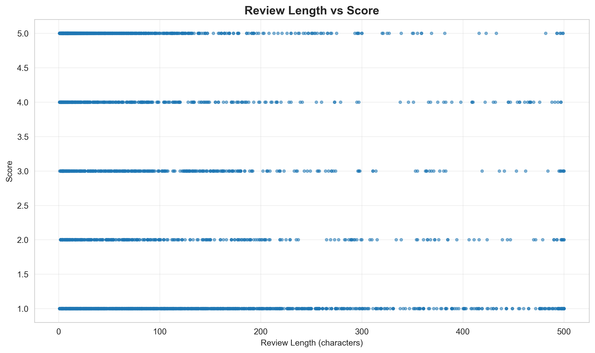
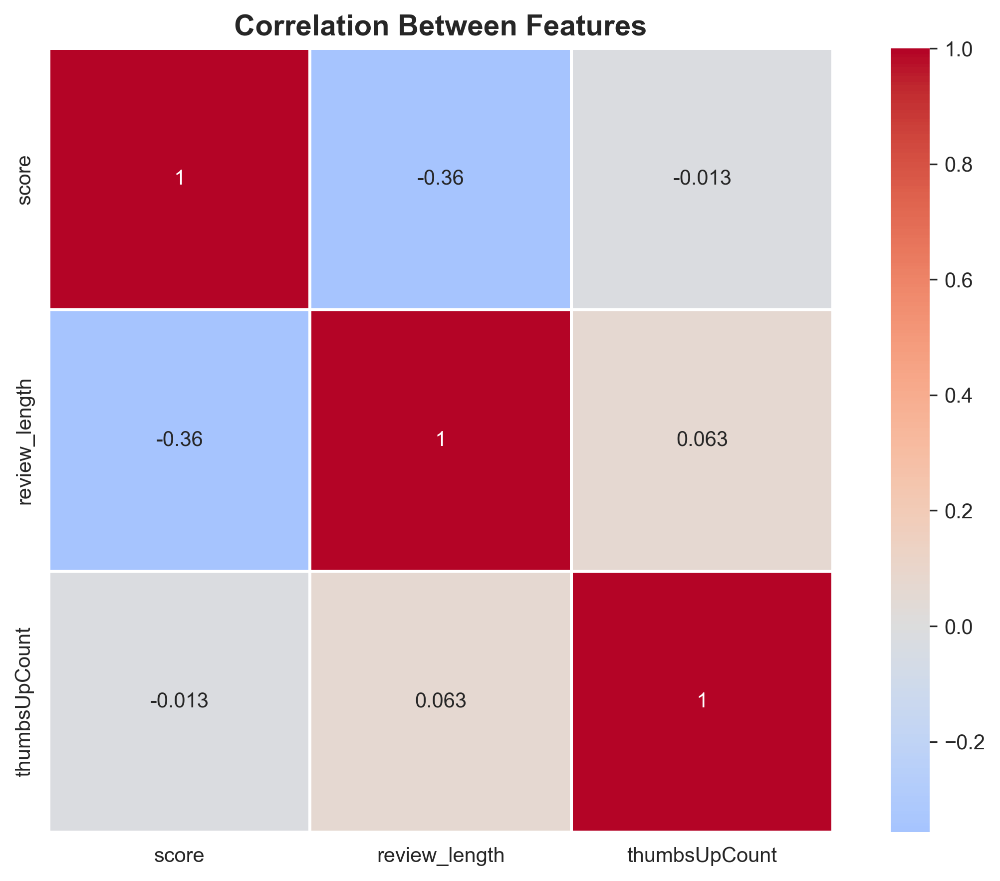

# Google Play Store Reviews Analysis

Analysis of Google Play Store app reviews to discover key factors responsible for app engagement and success. This project performs data cleaning, feature engineering, and exploratory data analysis (EDA) on a dataset of app reviews to provide actionable insights for developers.

## 📊 Key Analysis & Findings

This script processes and analyzes a dataset of 6,000 app reviews to uncover patterns in user behavior and sentiment.

* **Data Cleaning:** Handles missing values to ensure data quality.
* **Feature Engineering:** Creates new features like `review_length`, `review_year`, and `review_month` to enable deeper analysis.
* **Sentiment Analysis:** Calculates the overall positive review rate (4-5 stars).
* **Engagement Metrics:** Identifies which app scores (1-5) receive the most "thumbs up" from other users.
* **Top Performers:** Ranks apps based on both the total number of reviews and the average user score.
* **Temporal Trends:** Analyzes how review volume and sentiment have changed over time.

## 📈 Visualizations

The analysis generates several plots to visualize the findings. The central output is a comprehensive dashboard summarizing the key metrics.

### Comprehensive Analysis Dashboard


---

### Other Generated Visualizations
* **Score Distribution:** A histogram showing the frequency of each review score (1-5).
    * 
* **Engagement by Score:** A bar chart showing the average "thumbs-up" count for each score, revealing which reviews users engage with most.
    * 
* **Top Apps:** Bar charts ranking the top apps by the number of reviews and by average score.
    * 
    * 
* **Temporal Trends:** Line charts showing review volume and average score over time.
    * 
* **Review Length:** Analysis of how review length correlates with the score given.
    * 
* **Correlation Heatmap:** A heatmap showing the correlation between numerical features like `score`, `thumbsUpCount`, and `review_length`.
    * 


## 💡 Key Takeaways for Developers

Based on the analysis, several key factors for app success were identified:

* **Maintain 4+ Star Ratings:** Apps with an average rating above 4.0 stars are consistently linked to higher user retention and engagement.
* **Respond to Negative Reviews:** Actively replying to negative feedback can help improve overall app sentiment and user perception.
* **Monitor App Versions:** Keep a close eye on reviews for new app versions to identify and fix bugs or unpopular changes quickly.
* **Encourage Detailed Reviews:** Longer, more detailed reviews are a sign of high user engagement.
* **Boost Engagement:** Focus on strategies to get users to "thumb up" helpful reviews, as this increases their visibility.

## 🛠️ Technologies Used

* **Python 3**
* **pandas:** For data manipulation and analysis.
* **numpy:** For numerical operations.
* **matplotlib & seaborn:** For data visualization.

## 🚀 How to Run

1.  **Clone the repository:**
    ```bash
    git clone [https://github.com/your-username/your-repository-name.git](https://github.com/your-username/your-repository-name.git)
    cd your-repository-name
    ```

2.  **Install the required libraries:**
    ```bash
    pip install pandas numpy matplotlib seaborn
    ```
    *(Or, if you have a `requirements.txt` file):*
    ```bash
    pip install -r requirements.txt
    ```

3.  **Place the dataset in the root directory:**
    Ensure the dataset file `Training_Data_Google_Play_reviews_6000(in).csv` is in the same folder as the script.

4.  **Run the analysis script:**
    ```bash
    python playstore.py
    ```

5.  **View the results:**
    The script will print the key findings to the console and save all 8 visualization `.png` files to the project directory.

## 📁 Project Files

* `playstore.py`: The main Python script for analysis.
* `Training_Data_Google_Play_reviews_6000(in).csv`: The raw dataset (Note: You may want to add this to your `.gitignore` if it's too large).
* `comprehensive_dashboard.png`: Main dashboard output.
* `correlation_heatmap.png`: Heatmap of feature correlations.
* `engagement_analysis.png`: Plot of thumbs-up vs. score.
* `review_length_analysis.png`: Plot of review length vs. score.
* `score_distribution.png`: Histogram of review scores.
* `temporal_trends.png`: Line chart of reviews over time.
* `top_apps_by_reviews.png`: Bar chart of top apps by review count.
* `top_apps_by_score.png`: Bar chart of top apps by average score.
